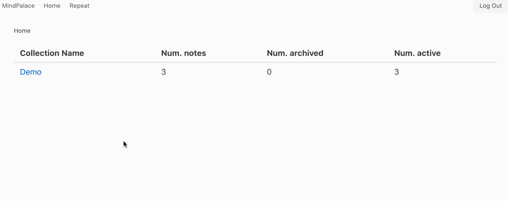

# Mind Palace

Mind palace: mnemonic note taking system.

This is a web application built with Django and React. You can host it yourself.



Pull requests welcome.

## Features

* Notes are written in Markdown and collected into collections
* You can search/view/edit/archive/delete notes.
* Notes can be *repeated* whereby they will pop up on the "Repeat" page on a schedule until bounced off to a later time
* Each note has its own repetition schedule, and a learning schedule
* 3 possible repeating schedules:
   - no repeating
   - repeat every N hours
   - repeat every N days (in the morning or evening)
* 2 possible learning schedules:
   - fixed
   - exponential (repetition period changes by factors of 50%/100%/150%/200%).
* Notes are composed of multiple cards, each written in Markdown. Cards can be "hidden". This can be used for e.g.
  language learning
* Notes can contain EJS templates. This allows dynamic content, for example 
* Multi-user support, one hosted system can have multiple users with their own collections 
* Can be hosted at a sub-URL, e.g. /this-is-my-url/mind-palace/ 
* Import and export into JSON

## TODOs

* Collection editing is currently done through the admin UI, mostly out of laziness, as it's rarely done.
* Minor bug: saving a note redirects to the collection view

## Roadmap

* Embed-an-image sections
* Embed-a-PDF sections
* Local / client-side encryption
* Better spaced repetition algorithms
* Collect data on repetitions

## Getting started locally

* Make sure to use a Python 3 virtual environment.

* Install all the dependencies:

```
pip install -r requirements.txt
```

* Install frontend dependencies:

```
cd frontend
npm install
``` 

* Run a build and collect static files

```
inv collectstatic
```

* Create your `LOCAL_ENV.dev`, populate the entries and source it

```
cp LOCAL_ENV.dev.template LOCAL_ENV.dev
source LOCAL_END.dev
```

* Create the database 

```
python manage.py migrate
```

* Create a superuser

```
python manage.py createsuperuser
```

* Run your server

```
python manage.py runserver
```

## Running in production

Roughly the above steps, but instead of `runserver`:

```
gunicorn mind_palace.mind_palace_site.wsgi -w 2 --log-level debug
```

You will want to proxy 